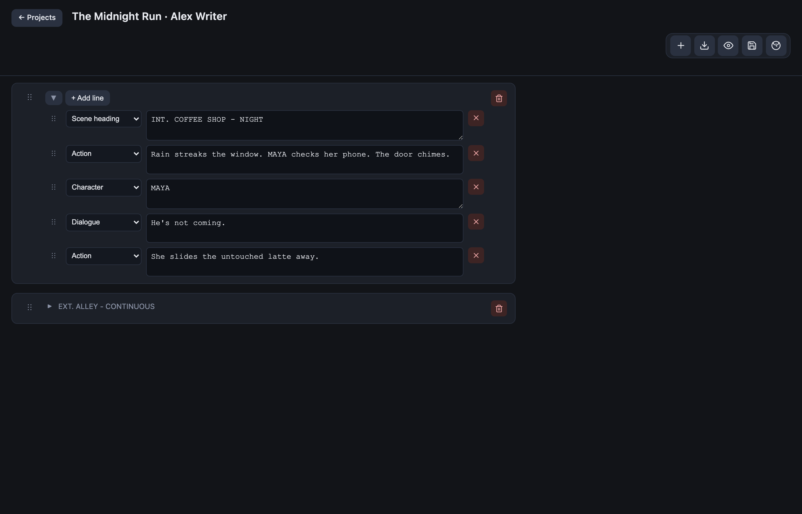
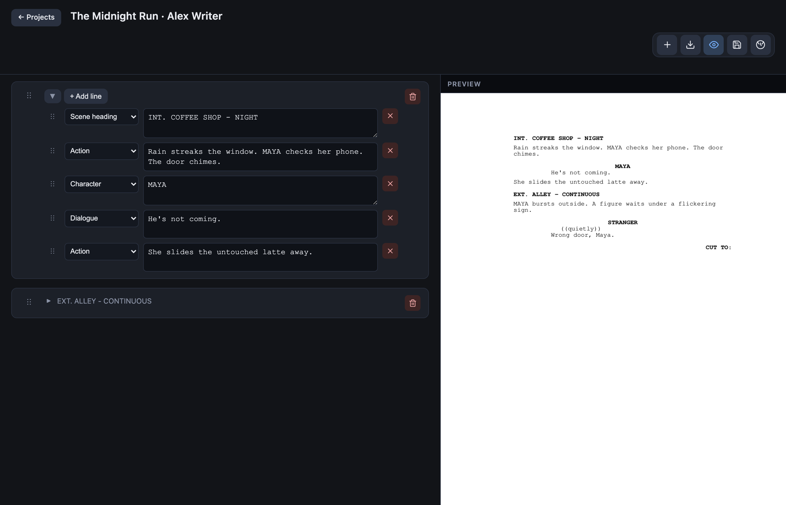
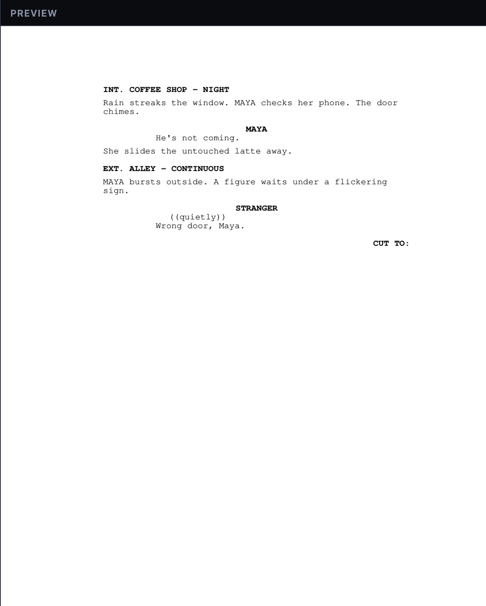
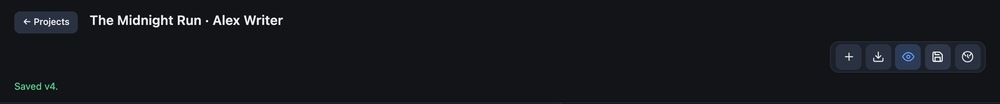
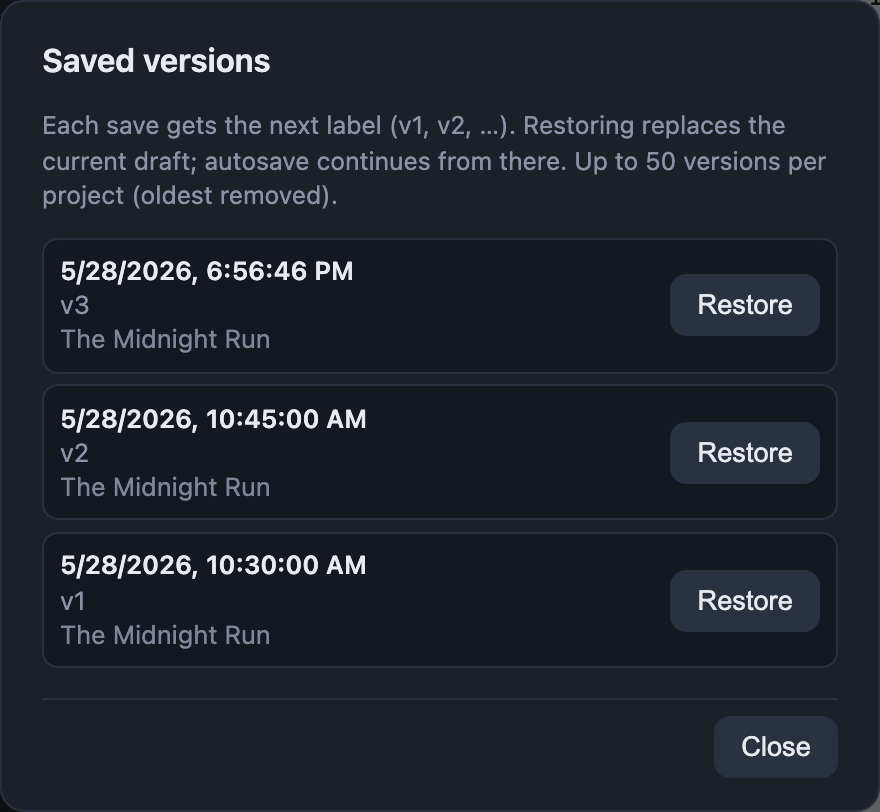
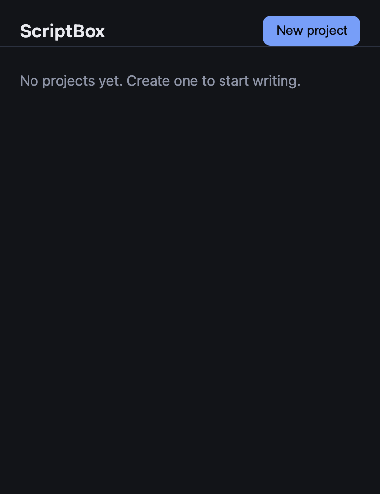

# ScriptBox · Screenwriting Tool

[](./LICENSE)

**ScriptBox** is a local-first web app for writing screenplays in standard format.
Create projects, edit scene-by-scene, autosave drafts, import existing PDFs,
preview formatted output, export to PDF, and keep named version snapshots.

Runs entirely on your machine — no account, no cloud required.

## Screenshots

### Writing — scene, action, character, dialogue

Each beat supports all standard line types. Pick a type from the dropdown and type directly in the editor.



### Live preview — formatted screenplay PDF

Toggle preview to see industry-style Courier layout update as you write. Scene headings, action, character cues, parentheticals, dialogue, and transitions are all positioned correctly.





### Saving versions

Click the save icon to create a numbered snapshot (`v1`, `v2`, …). A confirmation appears in the toolbar when a version is saved.



Open version history to browse snapshots and restore an older draft.



### Projects home



## Features

- **Project library** — multiple scripts with title, author, and last-updated time
- **Beat editor** — scene headings, action, character, parenthetical, dialogue, transitions
- **Autosave** — drafts stored on disk under `drafts/`
- **Version snapshots** — save labeled versions (`v1`, `v2`, …) and restore later (up to 50 per project)
- **PDF import** — upload a screenplay PDF and convert it into editable beats
- **PDF export & preview** — industry-style Courier layout with live preview
- **Embeddable API** — FastAPI routes can be mounted into another app (see [Mounting](#mounting-in-another-app))

## Requirements

- Python **3.10+**
- macOS, Linux, or Windows

## Quick start

```bash
git clone git@github.com:santoshimz/screenwriting-tool.git
cd screenwriting-tool

python3 -m venv .venv
source .venv/bin/activate          # Windows: .venv\Scripts\Activate.ps1
pip install -r requirements.txt

python server.py
```

Open **http://127.0.0.1:8765/** in your browser.

| URL | Purpose |
|-----|---------|
| `/` | Project list and new-project setup |
| `/edit?p=<project-id>` | Script editor |
| `/api/*` | REST API (import, export, drafts) |

Press `Ctrl+C` in the terminal to stop the server.

## How to use

1. **Create a project** — click **New project**, enter a title and optional author.
2. **Import (optional)** — on the setup screen, use **Import PDF** to load an existing script you own.
3. **Write** — open the editor and add beats. Each beat holds formatted lines (scene, action, dialogue, etc.).
4. **Preview** — toggle the preview panel to see the formatted PDF layout update as you type.
5. **Save versions** — use the save icon to create a named snapshot; open history to restore an older version.
6. **Export** — download the screenplay as a PDF from the toolbar.

Drafts are written to `drafts/<project-id>.json`. Version snapshots live under
`drafts/versions/<project-id>/`. These paths are gitignored by default.

## Project layout

```text
screenwriting-tool/
  server.py              # FastAPI app + static UI
  screenplay_routes.py   # REST endpoints
  screenplay_import.py   # PDF → beats parser
  pdf_export.py          # beats → PDF builder
  draft_store.py         # Autosave + version storage
  static/
    index.html           # Projects home
    edit.html            # Editor
  docs/readme-assets/    # README screenshots
  scripts/               # capture_readme_screenshots.py (maintainers)
  requirements.txt
```

## Mounting in another app

The API router is reusable. In a FastAPI app:

```python
from screenplay_routes import router as screenplay_router

app.include_router(screenplay_router)
app.include_router(screenplay_router, prefix="/screenplay")
```

Serve `static/index.html` and `static/edit.html` at `/` and `/edit` (or under `/screenplay/`).

## License & compliance

This repository is released under the **[MIT License](./LICENSE)** (Copyright © 2026 Santosh).

| Topic | Status |
|-------|--------|
| Application source code | Original work, MIT licensed |
| Dependencies | Permissive OSS only — see [THIRD_PARTY.md](./THIRD_PARTY.md) |
| Frontend | Vanilla HTML/CSS/JS — no copied UI kit |
| Screenplay formatting | Industry-standard layout conventions (not proprietary) |
| Sample content in docs | Fictional demo script only (`The Midnight Run`) |
| User scripts / PDFs | **Your content** — do not commit `drafts/` or imported PDFs |

**Import responsibly:** only upload PDFs you have the right to use. ScriptBox parses
text from PDFs locally; it does not redistribute third-party scripts.

## Contributing

Contributions are welcome. See [CONTRIBUTING.md](./CONTRIBUTING.md) for setup,
guidelines, and how to open a pull request.

## Security

To report a vulnerability, follow [SECURITY.md](./SECURITY.md).

## Code of conduct

This project follows [CODE_OF_CONDUCT.md](./CODE_OF_CONDUCT.md).
